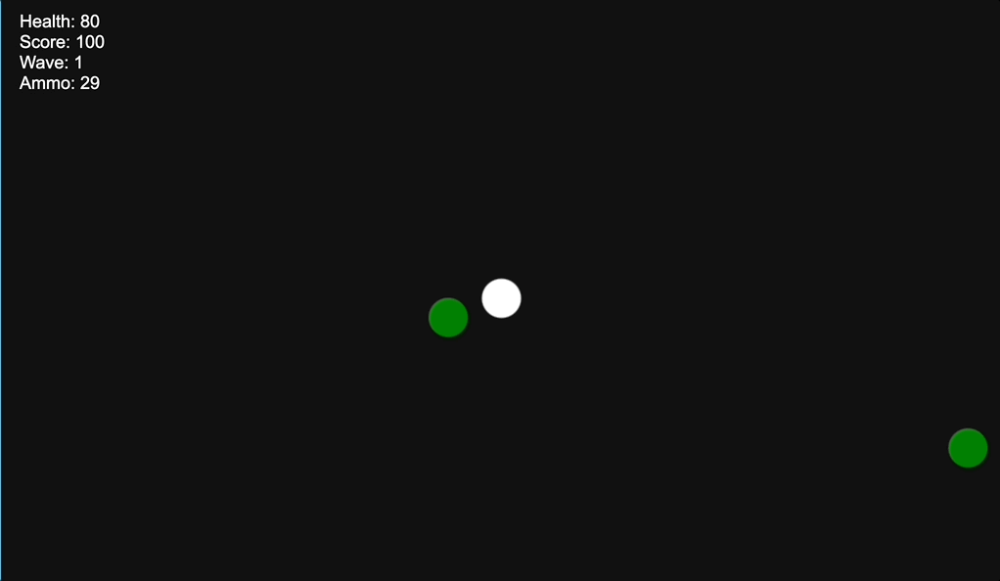
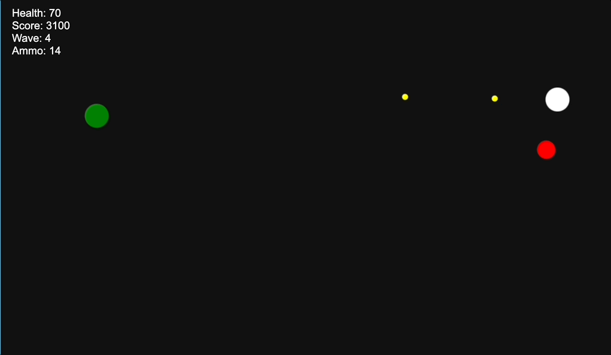

# Zombie Apocalypse MVP.md

# MVP Features

### Player Movement

**Priority:** P0  
**Implementation Timeline:** Day 1-3

**Core Requirements:**

- WASD to move player  
- Shift to sprint

**Technical Components:**

- Working tick system (NOT based on framerate)  
- Input manager

### Combat Systems

**Priority:** P0  
**Implementation Timeline:** Day 1-3

**Core Requirements:**

- Mouse aiming  
- [Essential functionality 2]

**Technical Components:**

- Mouse controlled camera  
- Projectile/Raycast bullet system  
- Firing pattern/Procedural recoil

**Simplifications:**

- Raycast, Firing pattern weapons (Counter-Strike style)

### Zombie Behavior

**Priority:** P0  
**Implementation Timeline:** Day 1-3

**Core Requirements:**

- Zombie pathfinding to the player  
- Movement patterns/abilities (L4D??)  
- Progressively scaling difficulty

**Technical Components:**

- Pathfinding system  
- Difficulty variables

**Simplifications:**

- Recommendable to postpone movement patterns/abilities

### HUD

**Priority:** P1  
**Implementation Timeline:** Day 3-5

**Core Requirements:**

- Functional UI displaying score, health, ammo, and current wave

### Lives and Health System

**Priority:** P1  
**Implementation Timeline:** Day 3-5

**Core Requirements:**

- Health depletes upon zombie contact  
- Game ends when health reaches 0

**Technical Components:**

- Object collision detection  
- Pickups

**Simplifications:**

- Could use replenishing resources instead of pickups

**Dependencies:**

- Zombie pathfinding  
- Zombie combat system  
- HUD

### Resource Management

**Priority:** P1  
**Implementation Timeline:** Day 3-5

**Core Requirements:**

- Dynamically spawned items

**Technical Components:**

- Randomly generated pickup locations

**Simplifications:**

- Could use replenishing resources instead of pickups

**Dependencies:**

- Health System  
- HUD

### Wave Progression

**Priority:** P1  
**Implementation Timeline:** Day 3-5

**Core Requirements:**

- Scaling difficulty variables

**Technical Components:**

- Difficulty variables implemented in Zombie generation

**Dependencies:**

- Zombie Behavior  
- HUD  
- Resource Management

# MVP Implementation Plan

## Day 1-3 (Core Framework)

- Player Movement  
- Combat Systems  
- Zombie Behavior

## Day 3-5 (Essential Features)

- HUD  
- Lives and Health System  
- Resource Management  
- Wave Progression

